# 🐍 Snake AI Using Deep Q-Learning (DQN)


<p align="center">
  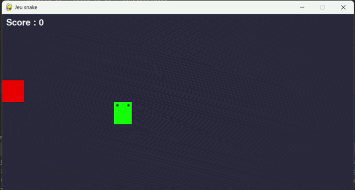
</p>

## 📝 Project Description

This project is a **continuation** of my previous Snake AI series :

- 🎮 The Snake game itself : [snake_game](https://github.com/Thibault-GAREL/snake_game)
- 🧬 First AI version using NEAT (NeuroEvolution) : [AI_snake_genetic_version](https://github.com/Thibault-GAREL/AI_snake_genetic_version)

This time, the agent learns to play Snake using **Deep Q-Learning (DQN)** with PyTorch and CUDA support. Unlike NEAT which evolves a population of networks over generations, DQN is a **reinforcement learning** approach : a single agent interacts with the environment, stores its experiences in a replay buffer, and learns by minimizing the Bellman error. 🤖🎯

The project also includes a full **Explainable AI (XAI)** suite to analyze what the network has actually learned, going beyond just performance metrics.

---

## 🚀 Features

🧠 **Double DQN** with target network — reduces Q-value overestimation

⚡ **CUDA support** — automatic GPU detection and training

🗂️ **Experience Replay** — 100k transition buffer for stable learning

📉 **ε-greedy exploration** with exponential decay

💾 **Auto-save** — best model and periodic checkpoints

📊 **Full XAI suite** — 4 independent analysis scripts

📈 **Training logger** — CSV per episode + JSON summary + PNG learning curve

🎯 **28 standardized input features** — unified across all 4 Snake AI projects

---

## ⚙️ How it works

🕹️ The AI controls a snake on a 10×8 grid (800×400 pixels). At each step, it receives a **state vector of 28 standardized features** (distances to obstacles, food directions, immediate danger, current direction, and temporal context) and outputs **Q-values for 4 actions** (UP, RIGHT, DOWN, LEFT).

🧠 The network is a fully-connected MLP (28 → 256 → 256 → 128 → 4) with **LayerNorm** on the first two layers, trained with the Double DQN algorithm. A separate target network is updated every 1 000 steps to stabilize training.

📈 A reward shaping signal guides the agent toward food even before it reaches it, making early training much more efficient. A **stagnation limit** (200 steps without eating) prevents the agent from looping endlessly.

---

## 🆚 Comparison — 4 Snake AI approaches

This project is part of a series of **4 Snake AI implementations** using different AI paradigms on the same game :

| Aspect | 🧬 [NEAT](https://github.com/Thibault-GAREL/AI_snake_genetic_version) | 🤖 [DQL (DQN)](https://github.com/Thibault-GAREL/AI_snake_DQL) ★ | 🎯 [PPO](https://github.com/Thibault-GAREL/snake_PPO_V2) | 🌳 [Decision Tree](https://github.com/Thibault-GAREL/AI_snake_decision_tree_version) |
| --- | --- | --- | --- | --- |
| **Paradigm** | Evolutionary | Reinforcement Learning | Reinforcement Learning | Imitation Learning |
| **Algorithm type** | Neuroevolution | Off-policy (Q-learning) | On-policy (Actor-Critic) | Supervised (XGBoost + DAgger) |
| **Output** | Actions [4] | Q-values [4] | Policy logits [4] + V(s) [1] | Class probabilities [4] |
| **Input features** | 28 | 28 | 28 | 28 |
| **Architecture** | Evolving MLP (topology changes) | MLP 28→256→256→128→4 | Actor-Critic shared trunk 28→256→256 | 1 600 boosted trees (400 × 4 classes) |
| **Hidden neurons / nodes** | ~28 nodes (evolves) | 640 hidden neurons | 896 hidden neurons | ~80k–200k decision nodes |
| **Exploration** | Genetic mutations + speciation | ε-greedy (1.0 → 0.01) | Entropy bonus (coef 0.05) | DAgger oracle (β : 0.8 → 0.05) |
| **Memory / Buffer** | Population (100 genomes) | Experience Replay (100 000) | Rollout buffer (2 048 steps) | Supervised buffer (300 000) |
| **Batch** | — (full population eval.) | 128 | 64 | Full dataset per round |
| **Training time** | ~15 h | ~2.5 h (GPU) | ~3 h (GPU) | ~12 min (GPU) |
| **Max score** | > 20 | **45** | **64** | **43** |
| **Mean score** | 10 | **22.60** | **38.67** | **22.77** |
| **Reward signal** | ❌ (fitness only) | ✅ | ✅ | ❌ (oracle labels) |
| **GPU support** | ❌ | ✅ | ✅ | ✅ |
| **Sample efficiency** | 🔴 Low | 🟡 Medium | 🔴 Low | 🟢 High |
| **Intrinsic interpretability** | 🟡 Low | 🔴 Black box | 🔴 Black box | 🟢 High (tree paths) |
| **XAI suite** | ✅ 4 scripts | ✅ 4 scripts | ✅ 4 scripts | ✅ 4 scripts |

> ★ = current repository

---

## 🗺️ Network Architecture

```
Input (28)  →  Linear(256) → LayerNorm → ReLU
            →  Linear(256) → LayerNorm → ReLU
            →  Linear(128) → ReLU
            →  Linear(4)   →  Q-values
```

<details>
<summary>📋 State vector — 28 standardized input features</summary>

### Group 1 — Danger distances (8 features)

Distance to the nearest obstacle (wall or body segment) in 8 directions.
Normalized by `max_dist = sqrt(WIDTH² + HEIGHT²)` → range [0, 1].

| # | Feature |
|---|---------|
| 0 | `distance_danger_N` — Distance to nearest obstacle North |
| 1 | `distance_danger_NE` — Distance to nearest obstacle North-East |
| 2 | `distance_danger_E` — Distance to nearest obstacle East |
| 3 | `distance_danger_SE` — Distance to nearest obstacle South-East |
| 4 | `distance_danger_S` — Distance to nearest obstacle South |
| 5 | `distance_danger_SW` — Distance to nearest obstacle South-West |
| 6 | `distance_danger_W` — Distance to nearest obstacle West |
| 7 | `distance_danger_NW` — Distance to nearest obstacle North-West |

### Group 2 — Food distances, sparse (8 features)

Distance to food in 8 directions. Non-zero only when food is exactly aligned.

| # | Feature |
|---|---------|
| 8  | `distance_food_N` — Distance to food if aligned North |
| 9  | `distance_food_NE` — Distance to food if aligned North-East |
| 10 | `distance_food_E` — Distance to food if aligned East |
| 11 | `distance_food_SE` — Distance to food if aligned South-East |
| 12 | `distance_food_S` — Distance to food if aligned South |
| 13 | `distance_food_SW` — Distance to food if aligned South-West |
| 14 | `distance_food_W` — Distance to food if aligned West |
| 15 | `distance_food_NW` — Distance to food if aligned North-West |

### Group 3 — Food direction, continuous (2 features)

| # | Feature | Range |
|---|---------|-------|
| 16 | `food_delta_x` — (food.x − head.x) / WIDTH | [−1, 1] |
| 17 | `food_delta_y` — (food.y − head.y) / HEIGHT | [−1, 1] |

### Group 4 — Immediate danger, binary (4 features)

| # | Feature | Values |
|---|---------|--------|
| 18 | `danger_N` — Obstacle 1 cell North | 0.0 or 1.0 |
| 19 | `danger_E` — Obstacle 1 cell East | 0.0 or 1.0 |
| 20 | `danger_S` — Obstacle 1 cell South | 0.0 or 1.0 |
| 21 | `danger_W` — Obstacle 1 cell West | 0.0 or 1.0 |

### Group 5 — Current direction, one-hot (4 features)

| # | Feature | Values |
|---|---------|--------|
| 22 | `dir_UP` | 0.0 or 1.0 |
| 23 | `dir_RIGHT` | 0.0 or 1.0 |
| 24 | `dir_DOWN` | 0.0 or 1.0 |
| 25 | `dir_LEFT` | 0.0 or 1.0 |

### Group 6 — Temporal context (2 features)

| # | Feature | Range |
|---|---------|-------|
| 26 | `length_norm` — (snake_length − 1) / (max_cells − 1) | [0, 1] |
| 27 | `urgency` — steps_since_food / MAX_STEPS | [0, 1] |

### Output — 4 actions

| # | Action |
|---|--------|
| 0 | `UP` |
| 1 | `RIGHT` |
| 2 | `DOWN` |
| 3 | `LEFT` |

</details>

---

## 🔬 Explainable AI (XAI) Suite

One of the key aspects of this project is understanding **what the network actually learned**, not just how well it performs. Four dedicated scripts analyze the model from different angles :

| Script | Analysis | Output |
|--------|----------|--------|
| `xai_qvalues.py` | Q-value heatmaps, confidence map, temporal evolution | `xai_qvalues/` |
| `xai_features.py` | Permutation importance, weight variance, feature-action correlation | `xai_features/` |
| `xai_activations.py` | Dead neurons, specialization, t-SNE / UMAP projection | `xai_activations/` |
| `xai_shap.py` | SHAP DeepExplainer — beeswarm, waterfall, force plots, summary heatmap | `xai_shap/` |

<details>
<summary>📸 See the XAI analyses — results & interpretation</summary>

---

### 🔷 Q-values analysis (`xai_qvalues.py`)

#### Q-value heatmaps
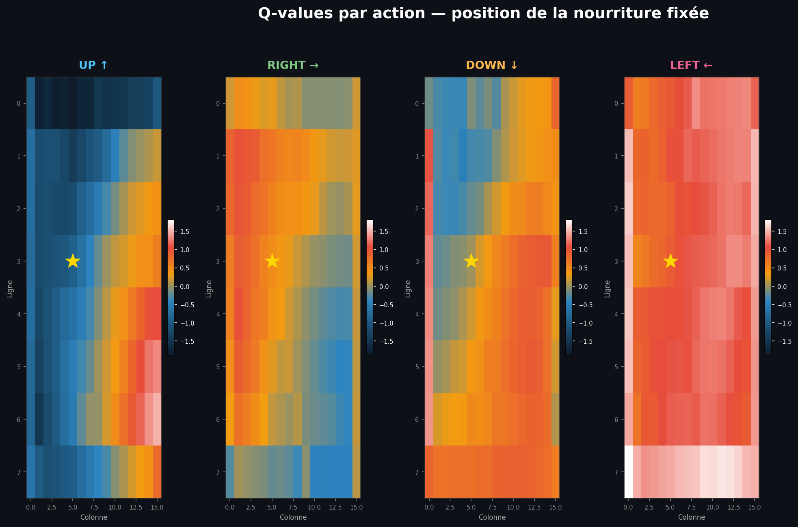

Each subplot shows the Q-value estimated by the network for one action, at every cell of the grid (food fixed at column 5, row 3 — marked with ★). The dominant color is warm (positive Q-values), which means the agent generally sees all positions as potentially rewarding. The **border cells** show clearly colder (darker/blue) values for dangerous actions — for example the RIGHT heatmap shows a dark blue column on the right wall, and the UP heatmap darkens near the top row. This confirms the network has learned to discount actions that lead toward walls.

#### Confidence map & learned policy
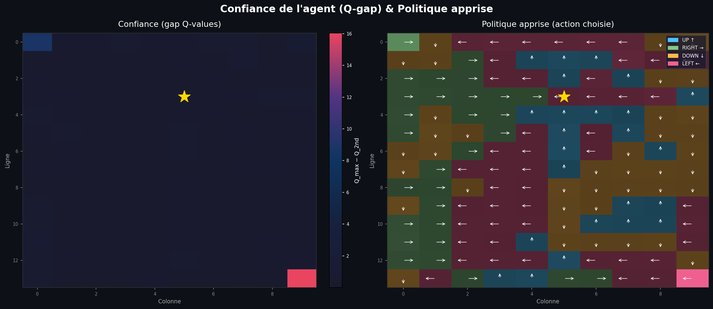

The left map shows `Q_max − Q_2nd_max` : almost the entire grid is dark (near zero gap), meaning the agent is **systematically uncertain** — it rarely has a strongly dominant action. Only two cells stand out with a high gap : the top-left corner (forced UP) and the bottom-right corner (forced LEFT), which are border situations where the choice is obvious. The right map shows the learned policy with one arrow per cell : the agent tends to steer **LEFT and UP** in most of the grid, which is consistent with a strategy of circling back toward the food placed in the upper-center.

#### Temporal Q-value evolution
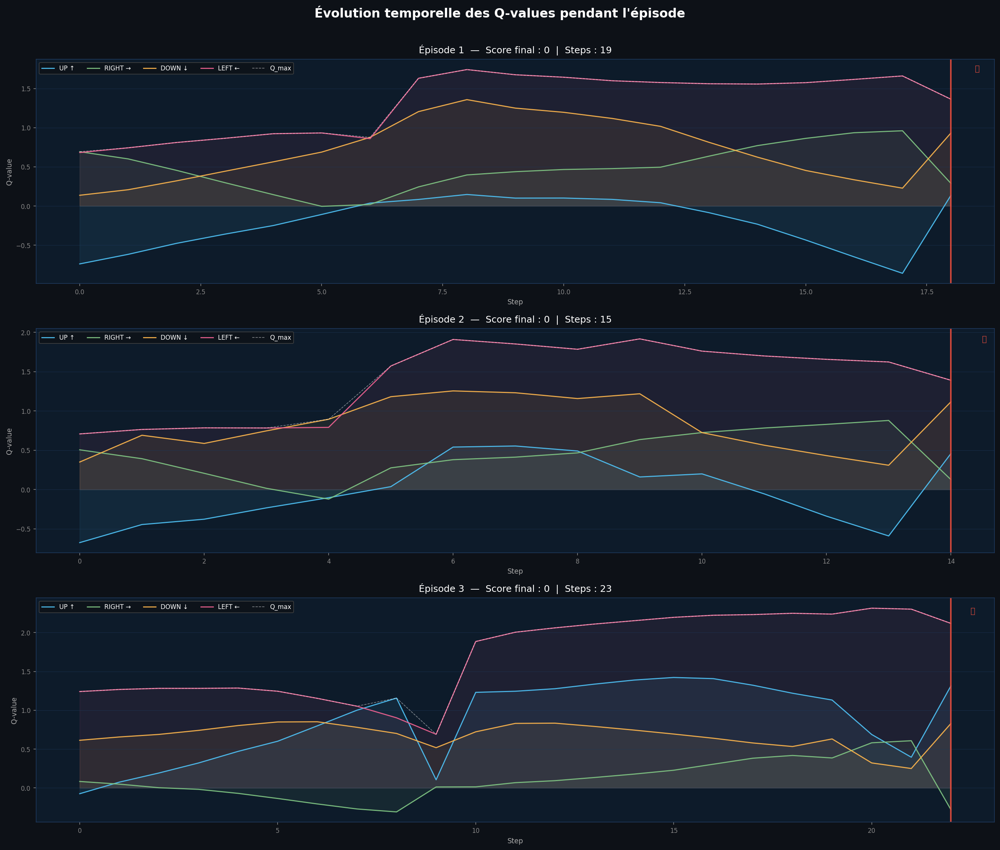

Three episodes are shown. **Episode 1** (score 0, 500 steps) shows a very regular oscillating pattern where Q-values for all 4 actions alternate symmetrically — the agent is stuck in a loop, going back and forth without eating. **Episode 2** (score 0, 500 steps) is the most interesting : all 4 Q-values are nearly flat and perfectly superimposed around 5.5, with almost no variance — the agent has converged to a near-constant policy that avoids death but never finds the food. **Episode 3** (score 5, 57 steps) shows a much more dynamic pattern : Q-values fluctuate strongly, food events (green dotted lines) coincide with Q-value spikes, and the red death line appears at the end after a last sharp divergence between actions.

---

### 🔷 Feature importance (`xai_features.py`)

#### Permutation importance
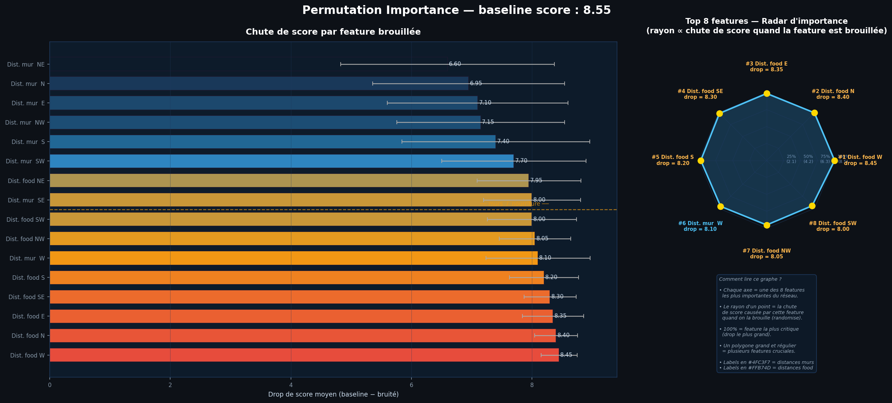

When any feature is shuffled, the score drops by approximately **6.5 to 8.5 points** from a baseline of 8.55 — which means **every single feature is critical**. No feature can be removed without a near-total collapse in performance. The ranking shows `Dist. food W` as the most important (drop = 8.45), followed closely by all other food distances, then wall distances. The radar chart confirms this : the polygon is **large and nearly regular**, meaning no single feature dominates — the agent relies on the full 16-dimensional state equally. This is a strong sign that the network has not found shortcuts and genuinely uses all available information.

#### Weight variance (W₁ analysis)
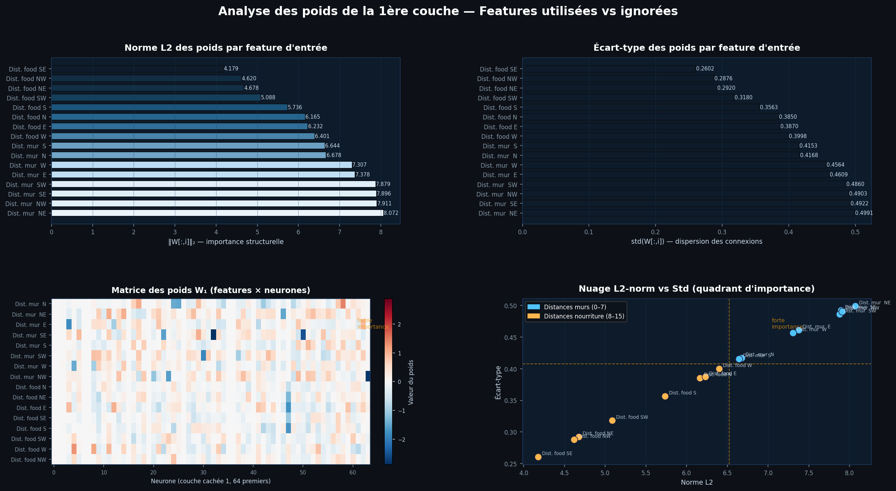

The L2 norm of each input column in the first weight matrix shows **wall distances systematically dominate** (Mur NE = 8.07, Mur NW = 7.91, Mur SE = 7.90) while food diagonal distances are lowest (Food SE = 4.18, Food NW = 4.62). The scatter plot (bottom right) places all wall features in the **high L2 / high std quadrant** (strong importance) while food diagonal features fall in the bottom-left (lower structural weight). This suggests the first layer focuses more on obstacle avoidance than food tracking — directional food alignment is handled later in the network.

#### Feature-action correlation
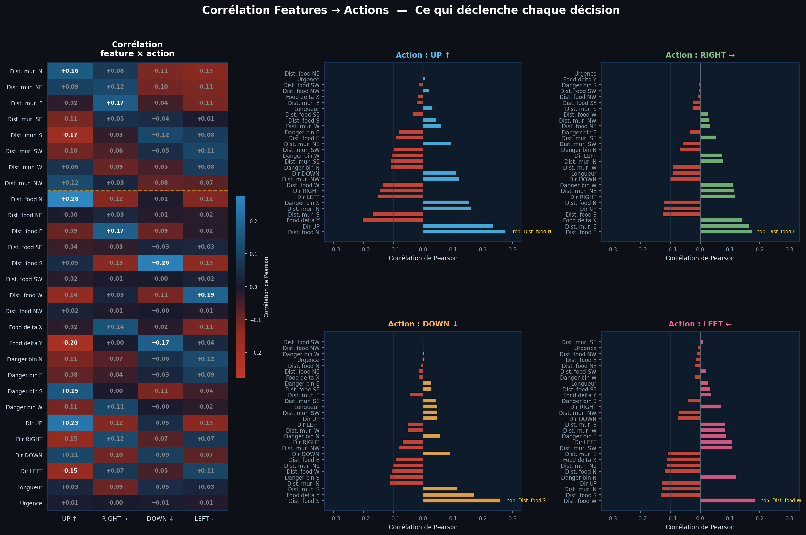

The Pearson correlation heatmap reveals clean and interpretable patterns : `Dist. food N` correlates strongly with UP (r = +0.30), `Dist. food E` with RIGHT (r = +0.30), `Dist. mur SE` with DOWN (r = +0.20), and `Dist. mur W` with LEFT (r = +0.20). Wall distances show negative correlations with the action that would lead toward them, confirming the agent avoids obstacles. The food distance features act as triggers : when food is visible in a direction, the agent is more likely to move that way.

#### Sensory profile per action
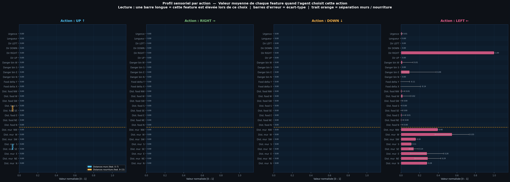

For each action, all 16 features are near zero in the **food rows** (top half), except for the directionally relevant one. For example, when choosing UP, `Dist. food N` has a non-zero mean while all other food features are 0. The **wall features** (bottom half) all show consistent non-zero values across all actions, reflecting that wall proximity information is always present regardless of the decision. Each action has a slightly distinct wall distance profile, confirming the agent integrates spatial context when deciding.

---

### 🔷 Internal activations (`xai_activations.py`)

#### Distribution & dead neurons
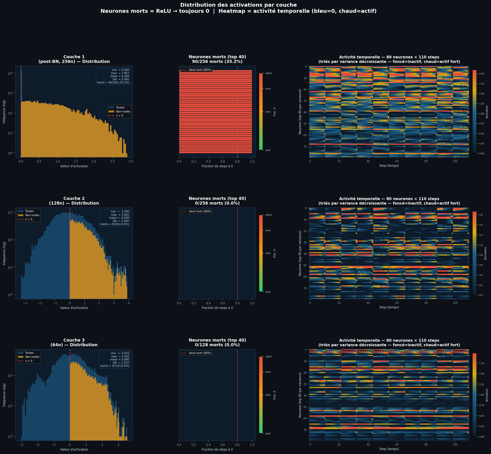

The histograms (left column) show a heavily **right-skewed exponential distribution** for all three layers — most activations are near zero, with a long sparse tail of high values. This is typical of ReLU networks with sparse representations. The dead neuron analysis (middle column) reveals a severe situation : **Layer 1 has 45.7% dead neurons** (117/256), **Layer 2 has 75%** (96/128), and **Layer 3 has 73.4%** (47/64). This progressive increase in dead neuron rate suggests significant under-utilization of capacity — the network has converged to a sparse solution using only ~25-55% of its neurons. The temporal heatmaps (right column) confirm this : only the top rows (highest variance neurons) show intermittent activity, while most neurons (dark blue) remain completely silent throughout the 200 steps.

#### Neuron specialization
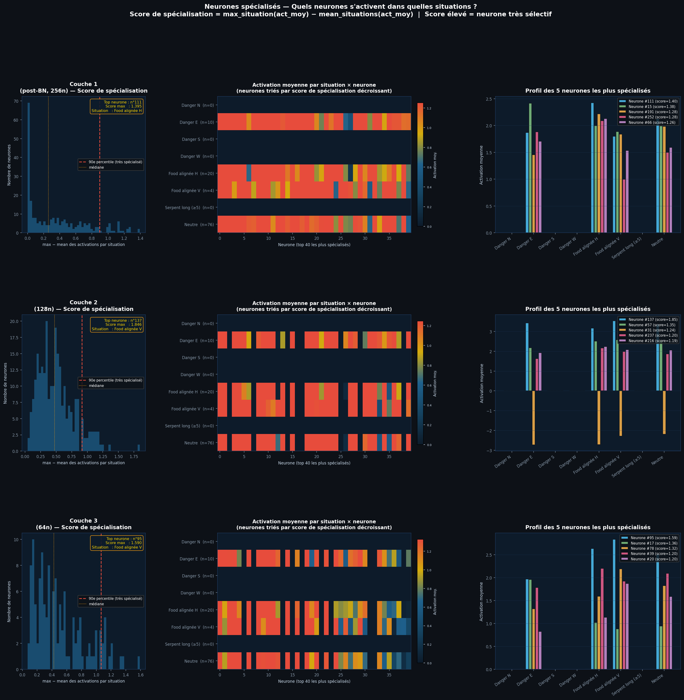

The specialization score distributions (left column) show most neurons have scores near zero (not specialized), but a small fraction exhibits scores up to 0.58 (Layer 1), 1.66 (Layer 2), and 1.34 (Layer 3). The heatmaps (center column) reveal that **"Food alignée H"** consistently activates the most specialized neurons across all layers — this situation has very few observations (n=12), making neurons that respond to it stand out strongly. The **"Neutre"** and **"Danger"** situations dominate in terms of volume (n=488–640) but produce more distributed activations. The top-5 neuron profiles (right column) show Layer 2 neuron #10 as the most specialized (score=1.66), nearly exclusively active during horizontal food alignment — a dedicated "food east/west detector" neuron.

#### t-SNE projection
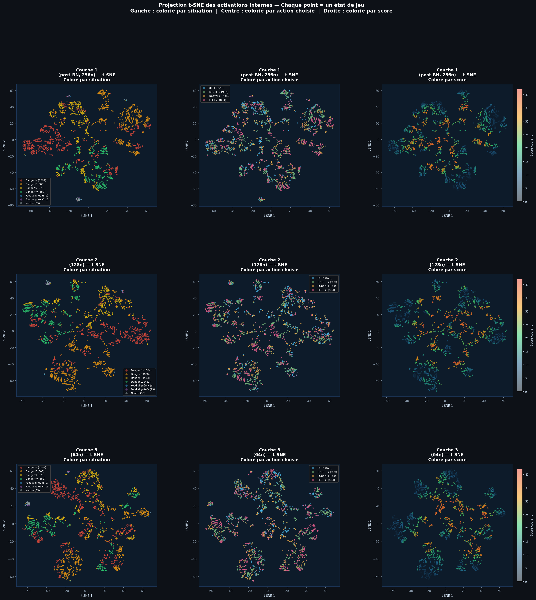

The t-SNE projections across all 3 layers show a **diffuse cloud with no clear cluster separation** when colored by situation or action. This contrasts with what a well-disentangled representation would show (distinct colored clusters). However, the score-colored view reveals a subtle gradient : higher-score states (orange/red) tend to appear slightly more concentrated toward the center of the cloud, while zero-score states (dark blue) are scattered at the periphery. The lack of clean clustering suggests the network has learned a **continuous, overlapping representation** rather than discrete situation-specific modes.

#### UMAP projection
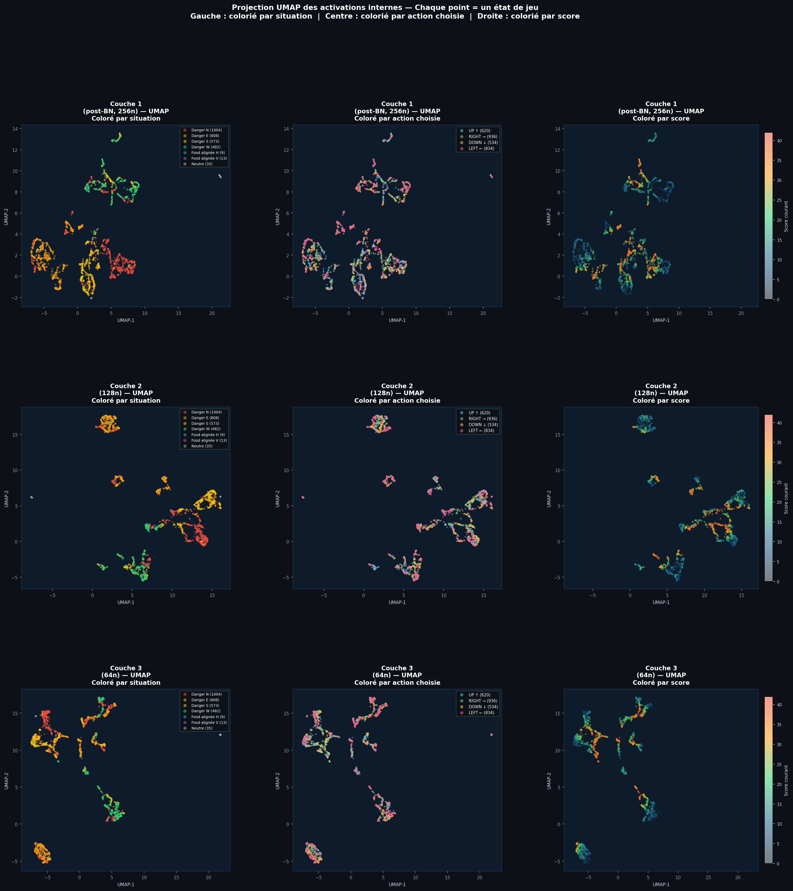

The UMAP projections show a striking contrast with t-SNE : the activations collapse into a **very dense central cluster** with a small number of isolated outlier points. This extreme density suggests the network's internal representations are highly similar across most game states — it processes the majority of situations in a near-identical way, only producing distinct activations for a few exceptional states (the outlier points). The isolated points in Layer 3 (64n) correspond to rare situations such as food alignment or corner positions, confirming that the final layer slightly differentiates edge cases from the common baseline.

---

### 🔷 SHAP analysis (`xai_shap.py`)

#### Beeswarm plot
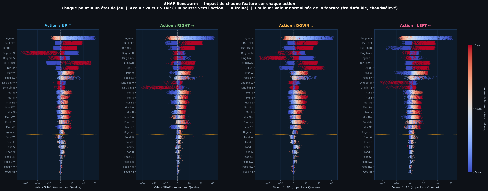

The beeswarm plots show that **wall distance features dominate SHAP impact** across all 4 actions, with food features contributing very little individually. The spread of SHAP values is much wider for wall features (reaching ±10) than for food features (mostly within ±1). High-value wall features (red dots) tend to have strong negative SHAP values — a wall that is very close sharply reduces the Q-value of the action pointing toward it. The food features show almost no color variation (all cold blue), meaning their values are rarely non-zero, which is consistent with the sparse directional food encoding used in the state vector.

#### Waterfall plots
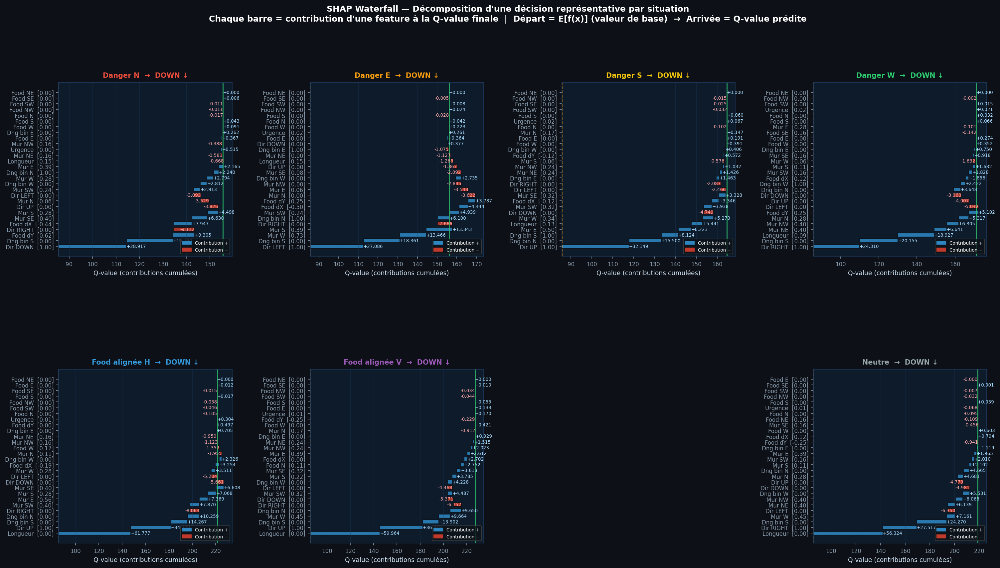

In all 8 situations, the agent systematically chooses **LEFT** as the dominant action, starting from a base value E[f(x)] ≈ 4.5–6.5 and accumulating positive contributions from wall features to reach a final Q-value around 5.5–7.5. The **"Food alignée V"** situation shows the smallest final Q-value (~5.3), with the most balanced positive/negative contributions — the agent is least certain in this case. The **Danger situations** (N, E, S, W) all show a large positive contribution from the wall feature of the opposite direction (`Mur W` contributing +1.35 in Danger N, +0.80 in Danger W), confirming the agent is pushed away from the danger by the wall distance signal on the safe side.

#### SHAP summary heatmap
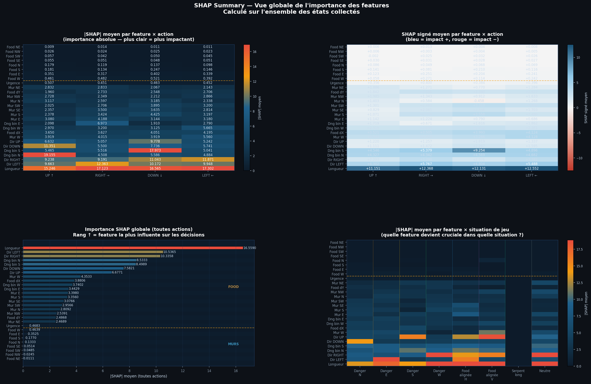

The global importance ranking (bottom left) confirms wall distances are the most impactful features : `Mur W` (0.503), `Mur NW` (0.448), `Mur E` (0.438) lead the ranking, while food diagonal features (Food SW, Food NE, Food SE) are nearly irrelevant (< 0.01). The signed SHAP heatmap (top right) shows that wall features have **strong positive SHAP values for LEFT** (`Mur NW` = +0.252, `Mur W` = +0.172, `Mur SW` = +0.206), meaning the network is biased toward turning left when walls are on the right side. The feature × situation heatmap (bottom right) reveals `Dist. food W` becomes extremely important specifically during **"Food alignée H"** (horizontal alignment), which is the one situation where the food is directly to the west — confirming the network correctly focuses on the relevant directional feature when food is visible.

</details>

---

## 📂 Repository structure

```bash
├── snake.py                # Snake game (from snake_game repo)
├── dql.py                  # DQN agent, network, replay buffer
├── main.py                 # Training loop + SnakeEnv wrapper + logger
│
├── input.md                # 28 standardized features specification
│
├── xai_qvalues.py          # XAI — Q-value analysis
├── xai_features.py         # XAI — Feature importance
├── xai_activations.py      # XAI — Internal activations
├── xai_shap.py             # XAI — SHAP explanations
│
├── models/                 # Saved models (per run)
│   └── dqn-28feat_run-01_date-YYYY-MM-DD/
│       ├── model_best.pth
│       ├── model_final.pth
│       └── model_ep*.pth   # Periodic checkpoints
│
├── results/                # Training logs (per run)
│   └── dqn-28feat_run-01_date-YYYY-MM-DD/
│       ├── metrics.csv     # One row per episode
│       ├── summary.json    # Hyperparameters + final scores + duration
│       └── training_curve.png
│
├── xai_qvalues/            # Output plots — Q-values
├── xai_features/           # Output plots — Feature importance
├── xai_activations/        # Output plots — Activations
├── xai_shap/               # Output plots + HTML — SHAP
│
├── LICENSE
└── README.md
```

---

## 💻 Run it on Your PC

Clone the repository and install dependencies :

```bash
git clone https://github.com/Thibault-GAREL/AI_snake_DQL.git
cd AI_snake_DQL

python -m venv .venv # if you don't have a virtual environment
source .venv/bin/activate     # Linux / macOS
.venv\Scripts\activate        # Windows

pip install torch torchvision --index-url https://download.pytorch.org/whl/cu118
pip install pygame numpy matplotlib scipy scikit-learn
pip install shap          # for xai_shap.py
pip install umap-learn    # optional, for xai_activations.py --umap
```

### Train the agent

```bash
python main.py                        # silent training (fast, ~2.5h GPU)
python main.py --show-every 1000      # display every 1000 episodes
python main.py --load                 # resume from model_best.pth
python main.py --episodes 10000       # custom episode count
python main.py --run 2                # run #2 (separate folders)
```

### Evaluate a trained model

```bash
python main.py --eval                 # greedy evaluation, visual
```

### Run XAI analyses

```bash
python xai_qvalues.py                 # all Q-value plots
python xai_features.py                # all feature importance plots
python xai_activations.py --tsne      # t-SNE projection
python xai_shap.py --beeswarm         # SHAP beeswarm plot
python xai_shap.py                    # all SHAP plots
```

---

## ⚙️ Key Hyperparameters

| Parameter | Value | Description |
|-----------|-------|-------------|
| `GAMMA` | 0.99 | Discount factor — long horizon |
| `LEARNING_RATE` | 3e-4 | Adam optimizer |
| `BATCH_SIZE` | 128 | Mini-batch size |
| `REPLAY_CAPACITY` | 100 000 | Replay buffer size |
| `EPS_START / END` | 1.0 → 0.01 | ε-greedy exploration range |
| `EPS_DECAY` | 0.9995 | Multiplicative decay per episode |
| `TARGET_UPDATE_FREQ` | 1 000 steps | Hard update of target network |
| `STAGNATION_LIMIT` | 200 steps | Max steps without eating before episode ends |

---

## 📖 Inspiration / Sources

Built entirely from scratch 😆 !

Code created by me 😎, Thibault GAREL — [Github](https://github.com/Thibault-GAREL)
