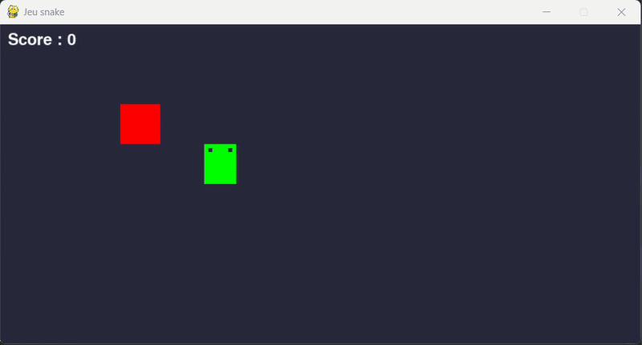

# 🤖 Snake AI Using Deep Q-Learning (DQN)


<p align="center">
  
</p>

## 📝 Project Description

This project is a **continuation** of my Snake AI series :

- 🎮 The Snake game itself : [snake_game](https://github.com/Thibault-GAREL/snake_game)
- 🧬 First AI version using NEAT (NeuroEvolution) : [AI_snake_genetic_version](https://github.com/Thibault-GAREL/AI_snake_genetic_version)
- 🌳 Second AI version using Decision Trees : [AI_snake_decision_tree_version](https://github.com/Thibault-GAREL/AI_snake_decision_tree_version)
- 🎯 Fourth AI version using PPO : [AI_snake_PPO_version](https://github.com/Thibault-GAREL/AI_snake_PPO_version)

This time, the agent learns to play Snake using **Deep Q-Learning (DQN)** with PyTorch and CUDA support. Unlike NEAT which evolves a population of networks over generations, DQN is a **reinforcement learning** approach : a single agent interacts with the environment, stores its experiences in a replay buffer, and learns by minimizing the Bellman error. Unlike the Decision Tree which imitates an oracle, DQN learns entirely by **trial and error** — no demonstrations, no supervision.

The project also includes a full **Explainable AI (XAI)** suite to understand what the network has actually learned, going beyond just performance metrics.

---

## 🔬 Research Question

> **How do we extract complex reasoning from a neural network?**

Neural networks are often described as **black boxes**: their internal decision logic remains opaque despite producing relevant results. This project goes beyond training a performant agent — it applies **Explainable AI (XAI)** techniques to understand *why* the network makes the decisions it does.

DQL is a paradigmatic black box: its Q-values are the result of three layers of non-linear transformations applied to 28 inputs, and no human can read its policy directly. Yet XAI tools — SHAP, permutation importance, UMAP projections — can uncover what the network learned to care about, and most importantly, **what it learned that NEAT and the Decision Tree never could**: a global awareness of the snake's own body size.

---

## 🎯 Context & Motivation

The deeper motivation behind this project series is the **alignment problem** — one of the most important open challenges in AI. It refers to the difficulty of ensuring that AI systems act in accordance with human intentions, not just formal instructions.

Concrete failures: an agent tasked with "maximizing cleanliness" might throw away useful objects (emergent objectives), hide dirt (reward hacking), or block humans from entering. The agent does exactly what it was told — not what was intended.

This gap is hard to diagnose when you can't see inside the model. One key obstacle is the **black box problem**: deep neural networks make decisions through immense parameter spaces whose internal logic is effectively unreadable to humans. **Explainable AI (XAI)** is one answer — making AI reasoning transparent and interpretable.

DQL is the first approach in this series where the agent develops a qualitatively different strategy from its predecessors — one that anticipates future constraints rather than simply reacting to the current state.

---

## 🩻 Interpretability Spectrum

A key conceptual framework underlying the whole project series:

| Box type | Definition | Example |
| -------- | ---------- | ------- |
| ⬜ White box | Fully readable logic — policy extractable directly | Q-table (tabular Q-learning) |
| 🟨 Grey box | Transparent structure, unreadable complexity | XGBoost (80k–200k nodes) |
| ⬛ Black box | Opaque internals despite good performance | **DQL (this project)** |
| 🟩 NEAT | Small enough for manual inspection + XAI | NEAT (16 inputs, evolved topology) |

DQL is the clearest example of a black box in this series: its learned strategy cannot be read from weights or tree nodes. **XAI tools are the only way in.** The paradox is that despite being the hardest to interpret, DQL has developed the most sophisticated strategy of the three approaches so far.

---

## 🚀 Features

  🧠 **Double DQN** with target network — reduces Q-value overestimation

  ⚡ **CUDA support** — automatic GPU detection and training

  🗂️ **Experience Replay** — 100k transition buffer for stable learning

  📉 **ε-greedy exploration** with exponential decay

  💾 **Auto-save** — best model and periodic checkpoints

  📊 **Full XAI suite** — 4 independent analysis scripts

  📈 **Training logger** — CSV per episode + JSON summary + PNG learning curve

  🎯 **28 standardized input features** — extending the 26 of the Decision Tree with 2 new temporal features

---

## ⚙️ How it works

  🕹️ The AI controls a snake on a 10×8 grid. At each step, it receives a **state vector of 28 features** and outputs **Q-values for 4 actions** (UP, RIGHT, DOWN, LEFT). Crucially, the outputs are **unbounded Q-values** — not probabilities or tanh scores — which changes how XAI tools read the model compared to NEAT or the Decision Tree.

  🧠 **Phase 1 — Exploration** : the agent starts with ε = 1.0 (pure random) and fills the replay buffer with diverse experiences. Each (state, action, reward, next_state) transition is stored.

  🎯 **Phase 2 — Learning** : once the buffer is large enough, mini-batches of 128 transitions are sampled. The network minimizes the Bellman error: `Q(s,a) ← r + γ · max Q_target(s', a')`. A separate **target network** is updated every 1 000 steps to stabilize training.

  📉 **Phase 3 — Exploitation** : ε decays from 1.0 to 0.01 over training. The agent progressively shifts from exploration to exploitation of its learned Q-function.

  ⏱️ A **stagnation limit** (200 steps without eating) prevents infinite loops and forces the agent to explore.

---

## 🗺️ Network Architecture

```
Input (28)  →  Linear(256) → LayerNorm → ReLU
            →  Linear(256) → LayerNorm → ReLU
            →  Linear(128) → ReLU
            →  Linear(4)   →  Q-values (unbounded)
```

The two new features compared to the Decision Tree — **snake length** and **urgency** — have the highest L2 norms in the first weight matrix (21.4 and 19.6 respectively), showing that the network immediately identified them as the most structurally important inputs. This is a clear signal that DQL learned something NEAT and the Decision Tree never integrated: a form of **global self-awareness**.

<details>
<summary>📋 State vector — 28 standardized input features</summary>

### Group 1 — Danger distances (8 features)

Distance to the nearest obstacle (wall or body segment) in 8 directions.
Normalized by `max_dist = sqrt(WIDTH² + HEIGHT²)` → range [0, 1].

| # | Feature |
|---|---------|
| 0 | `distance_danger_N` — Distance to nearest obstacle North |
| 1 | `distance_danger_NE` — Distance to nearest obstacle North-East |
| 2 | `distance_danger_E` — Distance to nearest obstacle East |
| 3 | `distance_danger_SE` — Distance to nearest obstacle South-East |
| 4 | `distance_danger_S` — Distance to nearest obstacle South |
| 5 | `distance_danger_SW` — Distance to nearest obstacle South-West |
| 6 | `distance_danger_W` — Distance to nearest obstacle West |
| 7 | `distance_danger_NW` — Distance to nearest obstacle North-West |

### Group 2 — Food distances, sparse (8 features)

Distance to food in 8 directions. Non-zero only when food is exactly aligned.

| # | Feature |
|---|---------|
| 8  | `distance_food_N` — Distance to food if aligned North |
| 9  | `distance_food_NE` — Distance to food if aligned North-East |
| 10 | `distance_food_E` — Distance to food if aligned East |
| 11 | `distance_food_SE` — Distance to food if aligned South-East |
| 12 | `distance_food_S` — Distance to food if aligned South |
| 13 | `distance_food_SW` — Distance to food if aligned South-West |
| 14 | `distance_food_W` — Distance to food if aligned West |
| 15 | `distance_food_NW` — Distance to food if aligned North-West |

### Group 3 — Food direction, continuous (2 features)

| # | Feature | Range |
|---|---------|-------|
| 16 | `food_delta_x` — (food.x − head.x) / WIDTH | [−1, 1] |
| 17 | `food_delta_y` — (food.y − head.y) / HEIGHT | [−1, 1] |

### Group 4 — Immediate danger, binary (4 features)

| # | Feature | Values |
|---|---------|--------|
| 18 | `danger_N` — Obstacle 1 cell North | 0.0 or 1.0 |
| 19 | `danger_E` — Obstacle 1 cell East | 0.0 or 1.0 |
| 20 | `danger_S` — Obstacle 1 cell South | 0.0 or 1.0 |
| 21 | `danger_W` — Obstacle 1 cell West | 0.0 or 1.0 |

### Group 5 — Current direction, one-hot (4 features)

| # | Feature | Values |
|---|---------|--------|
| 22 | `dir_UP` | 0.0 or 1.0 |
| 23 | `dir_RIGHT` | 0.0 or 1.0 |
| 24 | `dir_DOWN` | 0.0 or 1.0 |
| 25 | `dir_LEFT` | 0.0 or 1.0 |

### Group 6 — Temporal context (2 features) ← new vs. Decision Tree

| # | Feature | Range |
|---|---------|-------|
| 26 | `length_norm` — (snake_length − 1) / (max_cells − 1) | [0, 1] |
| 27 | `urgency` — steps_since_food / MAX_STEPS | [0, 1] |

### Output — 4 Q-values

| # | Action |
|---|--------|
| 0 | `UP` |
| 1 | `RIGHT` |
| 2 | `DOWN` |
| 3 | `LEFT` |

</details>

---

## ⚙️ Key Hyperparameters

| Parameter | Value | Description |
|-----------|-------|-------------|
| `GAMMA` | 0.99 | Discount factor — long horizon |
| `LEARNING_RATE` | 3e-4 | Adam optimizer |
| `BATCH_SIZE` | 128 | Mini-batch size |
| `REPLAY_CAPACITY` | 100 000 | Replay buffer size |
| `EPS_START / END` | 1.0 → 0.01 | ε-greedy exploration range |
| `EPS_DECAY` | 0.9995 | Multiplicative decay per episode |
| `TARGET_UPDATE_FREQ` | 1 000 steps | Hard update of target network |
| `STAGNATION_LIMIT` | 200 steps | Max steps without eating before episode ends |

---

## 🆚 Comparison — 4 Snake AI approaches

This project is part of a series of **4 Snake AI implementations** using different AI paradigms on the same game :

| Aspect | 🧬 [NEAT](https://github.com/Thibault-GAREL/AI_snake_genetic_version) | 🌳 [Decision Tree](https://github.com/Thibault-GAREL/AI_snake_decision_tree_version) | 🤖 [DQL (DQN)](https://github.com/Thibault-GAREL/AI_snake_DQN_version) ★ | 🎯 [PPO](https://github.com/Thibault-GAREL/AI_snake_PPO_version) |
| --- | --- | --- | --- | --- |
| **Paradigm** | Evolutionary | Imitation Learning | Reinforcement Learning | Reinforcement Learning |
| **Algorithm type** | Neuroevolution | Supervised (XGBoost + DAgger) | Off-policy (Q-learning) | On-policy (Actor-Critic) |
| **Architecture** | 16 → ~28 hidden (final, evolved) → 4 | 26 → 1 600 trees (400×4) → 4 | 28 → 256 → 256 → 128 → 4 | 28 → 256 → 256 → {128→4 (π), 128→1 (V)} |
| **Model complexity** | ~200–500 params (evolves) | ~80k–200k decision nodes | ~140k params | ~145k params |
| **Exploration** | Genetic mutations + speciation | DAgger oracle (β : 0.8 → 0.05) | ε-greedy (1.0 → 0.01) | Entropy bonus (coef 0.05) |
| **Memory / Buffer** | Population (100 genomes) | Supervised buffer (300 000) | Experience Replay (100 000) | Rollout buffer (2 048 steps) |
| **Batch** | — (full population eval.) | Full dataset per round | 128 | 64 |
| **Training time** | **~15 h** | **~12 min (GPU)** | **~2.5 h (GPU)** | **~3 h (GPU)** |
| **Max score** | **> 20** | **43** | **45** | **64** |
| **Mean score** | **10** | **22.77** | **22.60** | **38.67** |
| **GPU support** | ❌ | ✅ | ✅ | ✅ |
| **Sample efficiency** | 🔴 Low | 🟢 High | 🟡 Medium | 🔴 Low |
| **Generalization** | 🟡 Medium | 🔴 Low | 🟡 Medium | 🟢 High |
| **Intrinsic interpretability** | 🟡 Low | 🟡 Medium (ensemble = grey box) | 🔴 Black box | 🔴 Black box |

> ★ = current repository
> Each project includes an XAI suite of 4 analysis scripts.

<details>
<summary>📅 Development timeline — Gantt chart</summary>


</details>

---

## 🔬 Explainable AI (XAI) Suite

One of the key aspects of this project is understanding **what the network actually learned**, not just how well it performs. Four dedicated scripts analyze the model from different angles :

| Script | Analysis | Output |
|--------|----------|--------|
| `xai_qvalues.py` | Q-value heatmaps, confidence map, temporal evolution | `xai_qvalues/` |
| `xai_features.py` | Permutation importance, weight variance, feature-action correlation | `xai_features/` |
| `xai_activations.py` | Dead neurons, specialization, t-SNE / UMAP projection | `xai_activations/` |
| `xai_shap.py` | SHAP DeepExplainer — beeswarm, waterfall, force plots, summary heatmap | `xai_shap/` |

**Key findings from XAI analysis (baseline score: 28.2 apples) :**

- 📍 **Food delta Y** is the top permutation feature (score drop −25.4), followed by **Food delta X** (−25.15) — relative food displacement dominates over absolute distances
- 🔑 **Length (#3, −23.9) and Urgency (#4, −23.3)** — the two features absent from all previous experiments — are the third and fourth most important. The network developed something NEAT and the Decision Tree never had: a **global awareness of the snake's own state**
- 🌐 **SHAP global**: Length is the most influential feature across all actions combined (|SHAP| = 16.55) — the longer the snake, the more it adapts its trajectory. This is a qualitatively different strategy from food-chasing
- 🧠 **Dead neurons**: 72/256 dead (28.1%) in layer 1 — a ReLU phenomenon absent from NEAT (tanh never saturates to zero). Layers 2 and 3 have **zero dead neurons**, showing that LayerNorm acts as a regulator in deeper layers
- 🗺️ **UMAP projections** show a progressive and very clear structuration of internal states layer by layer, with near-perfect situation separation in layer 3 — sign of a rich internal representation
- 📊 **Policy map**: large coherent decision zones, stable Q-values over long sequences, sharp drops only at high-risk transitions

<details>
<summary>📸 Q-values analysis — xai_qvalues.py</summary>

Shows **what the network "thinks"** at each cell of the grid. The Q-value heatmaps reveal which action the model estimates as most valuable per position (food fixed), the confidence map shows where the agent is decisive vs. uncertain, and the temporal evolution tracks how Q-values shift step by step during real episodes — **Q-values are unbounded** here, unlike the probabilities or tanh scores of NEAT and the Decision Tree.

### Q-value heatmaps


### Confidence map & learned policy


### Temporal Q-value evolution


</details>

<details>
<summary>📸 Feature importance — xai_features.py</summary>

Answers the question: **which features actually drive the decisions?** Permutation importance measures the score drop when each feature is shuffled. The weight analysis of the first layer (L2 norms) exposes structural importance before any non-linearity. The correlation heatmap and sensory profiles show which feature tends to trigger which action.

Key finding: **ΔFood Y and ΔFood X dominate**, but the real revelation is **Length and Urgency** rising to 3rd and 4th — two features absent from all previous experiments. The L2 norm analysis of W₁ confirms it: Length (21.4) and Urgency (19.6) have the largest norms by far, meaning the first layer immediately identified them as the most structurally connected inputs.

### Permutation importance


### Weight analysis (W₁ — first layer)


### Feature-action correlation


### Sensory profile per action


</details>

<details>
<summary>📸 Internal activations — xai_activations.py</summary>

Looks inside the hidden layers. The dead neuron analysis reveals an **asymmetric situation**: layer 1 has 72/256 dead neurons (28.1%) — a ReLU-specific phenomenon where units that never fire carry no information — while layers 2 and 3 have **none**, showing LayerNorm prevents saturation in deeper layers. The UMAP projections show a progressive and very clear structuration of game states layer by layer, reaching near-perfect separation in layer 3 — a sign the network has learned a rich, hierarchical internal representation.

### Distribution & dead neurons


### Neuron specialization


### t-SNE projection of internal activations


### UMAP projection


</details>

<details>
<summary>📸 SHAP analysis — xai_shap.py</summary>

Uses **SHAP DeepExplainer** to decompose every prediction into per-feature contributions. The beeswarm gives a global ranking of feature impact across all decisions and actions. The waterfall plots break down one specific decision per game situation. The summary heatmap shows signed SHAP values per feature × action, revealing which features push the model toward or away from each action.

Key finding: **Length is the most influential feature globally** (|SHAP| = 16.55), with a strong positive impact on **all four directions** — the longer the snake, the more it adapts its trajectory in every dimension. This is direct evidence of a strategy that goes beyond food proximity, anticipating body constraints.

#### Beeswarm plot (global feature impact)


#### Waterfall plots (per game situation)


#### SHAP summary heatmap


</details>

---

## 💡 Key Insights

**DQL learned something the previous approaches never could**
The two new features — Length and Urgency — were absent from NEAT (16 inputs) and the Decision Tree (26 inputs). Yet DQL immediately leveraged them as its most structurally connected inputs (highest L2 norms in W₁) and its 3rd and 4th most impactful features by permutation. The network developed a form of **global self-awareness**: the longer the snake, the more it adapts its path. NEAT and the Decision Tree navigate toward food; DQL **anticipates the constraints of its own body**.

**Unbounded Q-values change the XAI reading**
Unlike NEAT (tanh outputs) and the Decision Tree (probabilities), DQL outputs raw Q-values. This means:
- High Q-values signal confident long-term reward estimates, not just immediate preferences
- The temporal evolution shows Q-values staying **stable and elevated during safe sequences**, with sharp drops only at risky transitions — the agent evaluates futures, not just states
- SHAP values decompose Q-value predictions rather than probabilities, giving a different interpretation scale

**Dead neurons are not necessarily a problem**
Layer 1 shows 72/256 dead neurons (28.1%) — an inherent ReLU consequence absent from NEAT (tanh) and the Decision Tree (non-neural). Yet layers 2 and 3 have zero dead neurons thanks to LayerNorm. The network routes the full representational load through a sparse first layer into dense deeper layers. A potential optimization: prune the dead units to reduce memory and compute with no performance cost.

**UMAP reveals a rich internal hierarchy**
The progressive structuration of states layer by layer — with near-perfect separation in the final hidden layer — confirms the network has learned a hierarchical, disentangled representation. The same game situation is processed very differently at each depth, culminating in a clean latent space where similar situations cluster together.

### Learned strategy comparison across the 4 experiments

| Agent | Strategy type | Most influential feature |
| ----- | ------------- | ------------------------ |
| NEAT | Circular, food-chasing, fixed | `food_N` (food distance North) |
| Decision Tree | Reactive, danger-aware, adaptive | `ΔFood Y` + `Danger E/W` |
| **DQL** | **Size-aware, body-anticipating** | **`Length` + `ΔFood X/Y`** |
| PPO | Symmetric risk, end-game anticipation | `Danger binary` (all directions) |

---

## 🔭 Perspectives

  🗺️ **Saliency Maps** — the natural next step: apply XAI to image recognition models, highlighting the exact pixels that triggered a decision (e.g., a cat's ears to classify it as a cat).

  🤖 **Automated XAI** — move from human-driven data science analysis to an AI that automatically analyzes any model and produces a readable strategy summary. Current tools are fast but shallow; an intelligent XAI system could reveal complex multi-feature interactions that no human would manually uncover.

  🏛️ **Neural network analysis database** — build a dataset of diverse trained agents, then train an AI to generalize: input a model, output its strategy in human-readable form.

  🧹 **Optimization via XAI** — the 72 dead neurons identified in layer 1 could directly guide model pruning: fewer parameters, same performance, lower compute cost and ecological footprint.

---

## 📂 Repository structure

```bash
├── snake.py                # Snake game (from snake_game repo)
├── dql.py                  # DQN agent, network, replay buffer
├── main.py                 # Training loop + SnakeEnv wrapper + logger
│
├── input.md                # 28 standardized features specification
│
├── xai_qvalues.py          # XAI — Q-value analysis
├── xai_features.py         # XAI — Feature importance
├── xai_activations.py      # XAI — Internal activations
├── xai_shap.py             # XAI — SHAP explanations
│
├── models/                 # Saved models (per run)
│   └── dqn-28feat_run-01_date-YYYY-MM-DD/
│       ├── model_best.pth
│       ├── model_final.pth
│       └── model_ep*.pth   # Periodic checkpoints
│
├── results/                # Training logs (per run)
│   └── dqn-28feat_run-01_date-YYYY-MM-DD/
│       ├── metrics.csv     # One row per episode
│       ├── summary.json    # Hyperparameters + final scores + duration
│       └── training_curve.png
│
├── xai_qvalues/            # Output plots — Q-values
├── xai_features/           # Output plots — Feature importance
├── xai_activations/        # Output plots — Activations
├── xai_shap/               # Output plots + HTML — SHAP
│
├── Rapport MPP - Thibault GAREL - 2026-04-13.pdf   # Full analysis report
├── LICENSE
└── README.md
```

---

## 💻 Run it on Your PC

Clone the repository and install dependencies :

```bash
git clone https://github.com/Thibault-GAREL/AI_snake_DQN_version.git
cd AI_snake_DQN_version

python -m venv .venv # if you don't have a virtual environment
source .venv/bin/activate     # Linux / macOS
.venv\Scripts\activate        # Windows

pip install torch torchvision --index-url https://download.pytorch.org/whl/cu118
pip install pygame numpy matplotlib scipy scikit-learn
pip install shap          # for xai_shap.py
pip install umap-learn    # optional, for xai_activations.py --umap
```

### Train the agent

```bash
python main.py                        # silent training (fast, ~2.5h GPU)
python main.py --show-every 1000      # display every 1000 episodes
python main.py --load                 # resume from model_best.pth
python main.py --episodes 10000       # custom episode count
python main.py --run 2                # run #2 (separate folders)
```

### Evaluate a trained model

```bash
python main.py --eval                 # greedy evaluation, visual
```

### Run XAI analyses

```bash
python xai_qvalues.py                 # all Q-value plots
python xai_features.py                # all feature importance plots
python xai_activations.py --tsne      # t-SNE projection
python xai_activations.py --umap      # UMAP projection
python xai_shap.py --beeswarm         # SHAP beeswarm plot
python xai_shap.py                    # all SHAP plots
```

---

## 📄 Full Report

A detailed report accompanies this project series, covering the full analysis : training methodology, manual interpretability, XAI results, and comparison across all 4 Snake AI approaches (NEAT, Decision Tree, DQL, PPO).

📥 [Download the report (PDF)](Rapport%20MPP%20-%20Thibault%20GAREL%20-%202026-04-13.pdf)

---

## 📚 Sources & Research Papers

- **NEAT algorithm** — [*Evolving Neural Networks through Augmenting Topologies*](http://nn.cs.utexas.edu/downloads/papers/stanley.ec02.pdf), Stanley & Miikkulainen (2002)
- **XGBoost** — [*A Scalable Tree Boosting System*](https://arxiv.org/abs/1603.02754), Tianqi Chen (2016)
- **DAgger** — [*A Reduction of Imitation Learning and Structured Prediction to No-Regret Online Learning*](https://arxiv.org/abs/1011.0686), Ross et al. (2011)
- **Deep Q-Learning** — [*A Theoretical Analysis of Deep Q-Learning*](https://arxiv.org/abs/1901.00137), Zhuoran Yang (2019)
- **PPO** — [*Proximal Policy Optimization Algorithms*](https://arxiv.org/abs/1707.06347), John Schulman (2017)
- **XAI Survey** — [*Explainable AI: A Survey of Needs, Techniques, Applications, and Future Direction*](https://arxiv.org/abs/2409.00265), Mersha et al. (2024)
- *L'Intelligence Artificielle pour les développeurs* — Virginie Mathivet (2014)

Code created by me 😎, Thibault GAREL — [GitHub](https://github.com/Thibault-GAREL)
